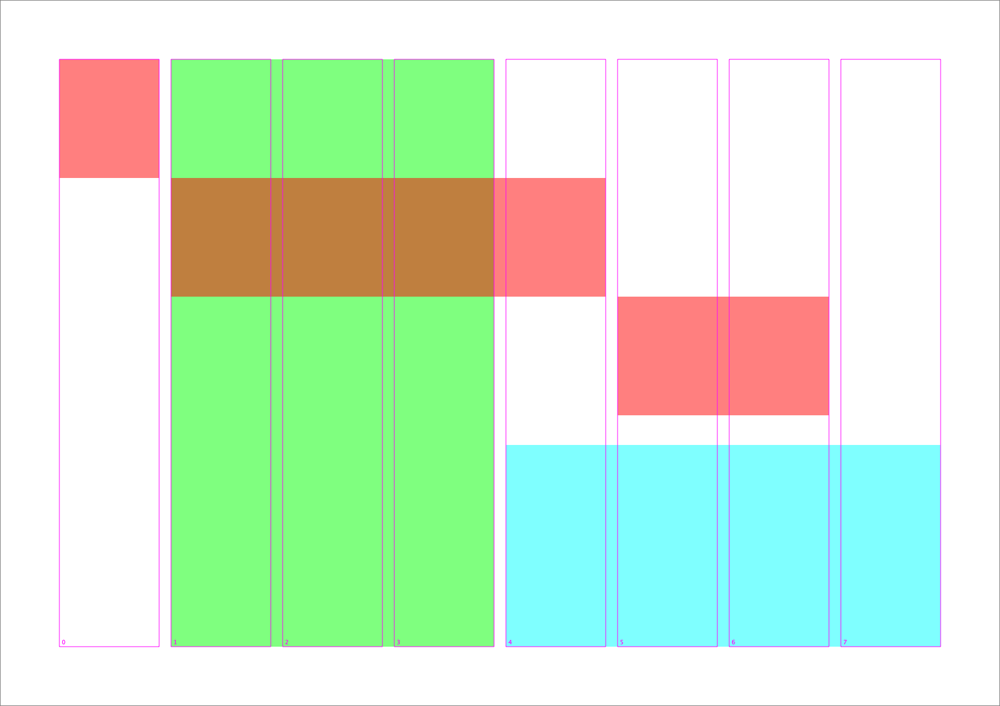
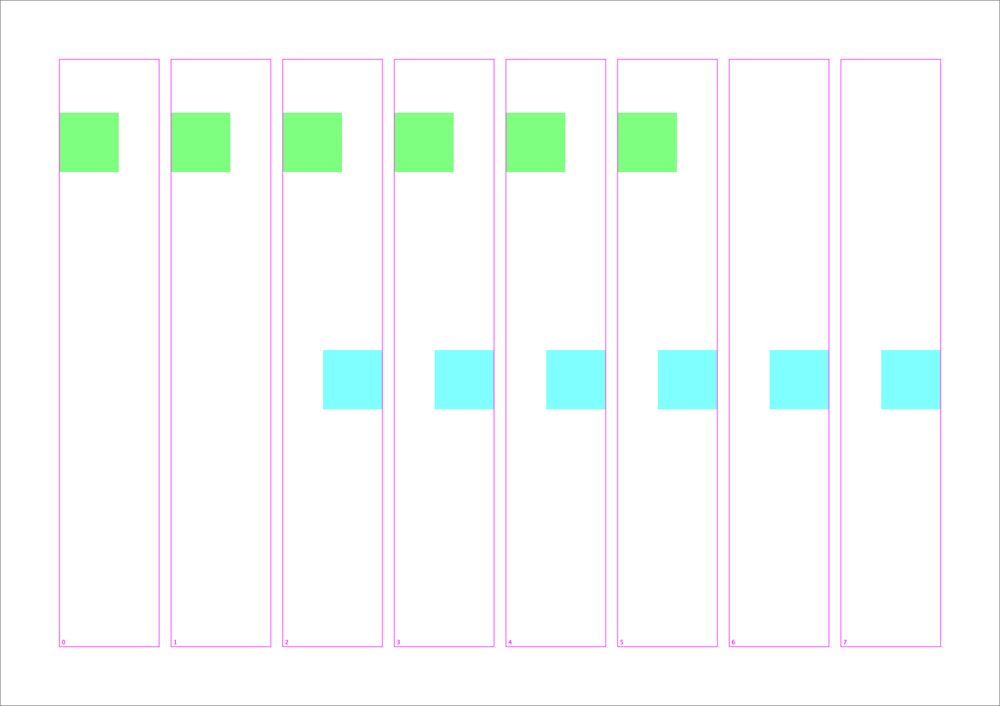
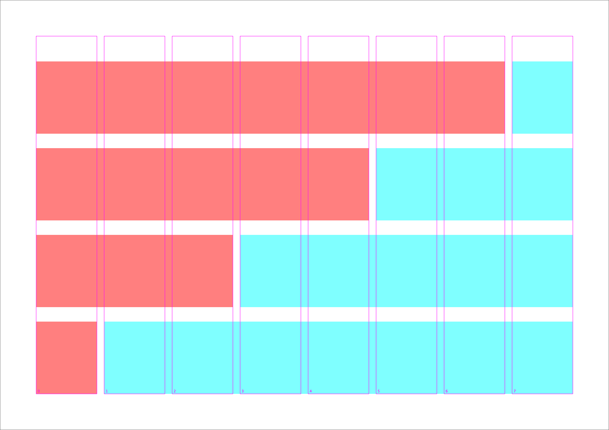
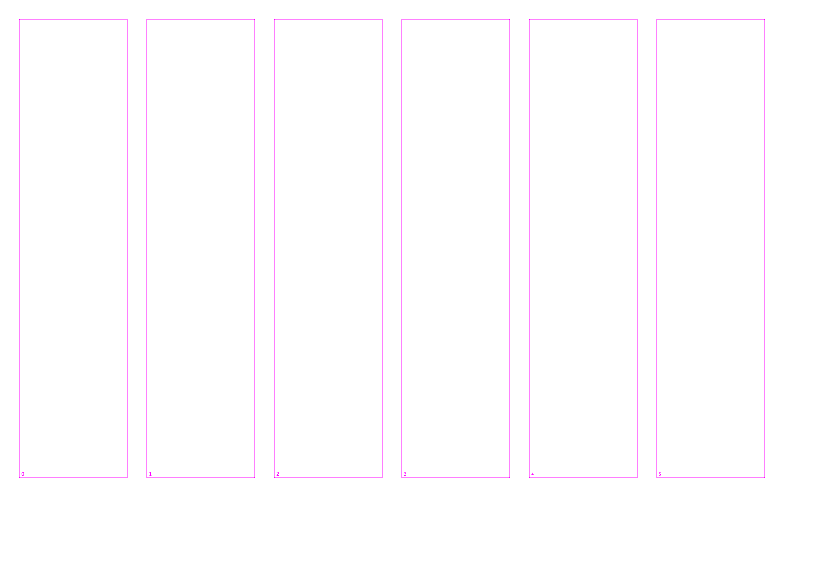

# drawBotGrid

**drawBotGrid** is a small library that make grid based layout easy in the always amazing [DrawBot](https://www.drawbot.com).


## ColumnGrid



`ColumnGrid((x, y, h, w), subdivisions=8, gutter=10)` divides the page in columns, separated by a gutter, making it easy to retrieve absolute x coordinates within the page.

`ColumnGrid` is callable by index, just like a list.  `ColumnGrid[1]` will return the y coordinate of the **left** of the second columns.
Negative indexes works, `ColumnGrid[-1]` will return the y coordinate of **right** of the last columns.

```python
newPage("A4Landscape")
columns = ColumnGrid((50, 50, 742, 495), subdivisions=8, gutter=10)

fill(0, 1, 0, .5)
rect(columns[0], 450, 50, 50)
rect(columns[1], 450, 50, 50)
rect(columns[2], 450, 50, 50)
rect(columns[3], 450, 50, 50)
rect(columns[4], 450, 50, 50)
rect(columns[5], 450, 50, 50)

fill(1, 1, 0, .5)
rect(columns[-1], 250, -50, 50)
rect(columns[-2], 250, -50, 50)
rect(columns[-3], 250, -50, 50)
rect(columns[-4], 250, -50, 50)
rect(columns[-5], 250, -50, 50)
rect(columns[-6], 250, -50, 50)

columns.draw(show_index=True)
```




`ColumnGrid` is also multipliable. `ColumnGrid * 3` will return the width of 3 columns, including the 2 separating gutters. `ColumnGrid * 1` will return the width of a single column, with no gutter. Negative mutlipliers work as well. 

```python
newPage("A4Landscape")

columns = ColumnGrid((50, 50, 742, 495), subdivisions=8, gutter=10)

fill(1, 0, 0, .5) 
rect(columns[0],  50, columns * 1, 100)
rect(columns[0], 170, columns * 3, 100)
rect(columns[0], 290, columns * 5, 100)
rect(columns[0], 410, columns * 7, 100)

fill(0, 1, 1, .5)
rect(columns[-1],  50, columns * -7, 100)
rect(columns[-1], 170, columns * -5, 100)
rect(columns[-1], 290, columns * -3, 100)
rect(columns[-1], 410, columns * -1, 100)

columns.draw(show_index=True)
```



Conviniently, instead of creating a `ColumnGrid` from its `(x, y, w, h)` coordinates, you can initiate it from its margin values relative to the document with `ColumnGrid.from_margint((left_margin, bottom_margin, right_margin, top_margin), subdivisions, gutter)`

```python
newPage("A4Landscape")

columns = ColumnGrid.from_margins((-20, -100, -50, -20), 6, 20)

columns.draw(show_index=True)
```



MORE README COMING SOON
