# drawBotGrid

**drawBotGrid** is a small library that make grid based layout easy in the always amazing [DrawBot](https://www.drawbot.com).


## install

In DrawBot, open the package manager with the menu Python -> Install Python Packages...

Enter the following url `git+https://github.com/mathieureguer/drawbotgrid` and press `go`.

For drawBot as a command line module, just enter the following terminal command: 
`pip install git+https://github.com/mathieureguer/drawbotgrid`


## ColumnGrid

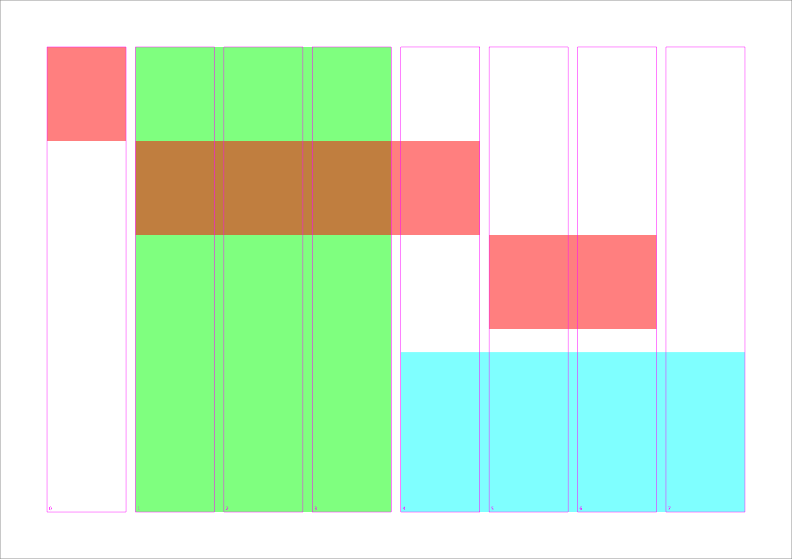

`ColumnGrid((x, y, h, w), subdivisions=8, gutter=10)` divides the page in a given number of columns, separated by a gutter, making it easy to retrieve absolute x coordinates within the page.

`ColumnGrid` is callable by index, just like a list.  `ColumnGrid[2]` will return the y coordinate of the *left* of the third column.
Negative indexes works, `ColumnGrid[-1]` will return the y coordinate of *right* of the last column.

```python
from drawBotGrid import ColumnGrid

newPage("A4Landscape")

columns = ColumnGrid((50, 50, 742, 495), subdivisions=8, gutter=10)

fill(0, 1, 0, .5) # green
rect(columns[0], 450, 50, 50)
rect(columns[1], 450, 50, 50)
rect(columns[2], 450, 50, 50)
rect(columns[3], 450, 50, 50)
rect(columns[4], 450, 50, 50)
rect(columns[5], 450, 50, 50)

fill(0, 1, 1, .5) # cyan
rect(columns[-1], 250, -50, 50)
rect(columns[-2], 250, -50, 50)
rect(columns[-3], 250, -50, 50)
rect(columns[-4], 250, -50, 50)
rect(columns[-5], 250, -50, 50)
rect(columns[-6], 250, -50, 50)

columns.draw(show_index=True)
```

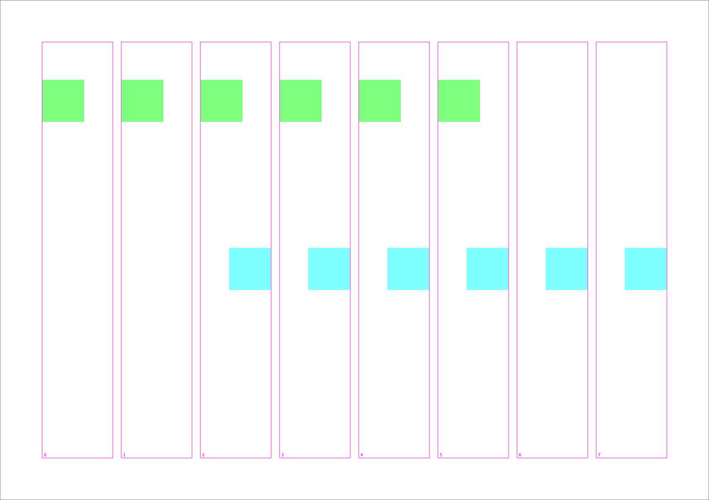


`ColumnGrid` is also multipliable. `ColumnGrid * 3` will return the width of 3 columns, including the 2 separating gutters. `ColumnGrid * 1` will return the width of a single column, with no gutter. Negative mutlipliers work as well. 

```python
from drawBotGrid import ColumnGrid

newPage("A4Landscape")

columns = ColumnGrid((50, 50, 742, 495), subdivisions=8, gutter=10)

fill(1, 0, 0, .5)  # red
rect(columns[0],  50, columns*1, 100)
rect(columns[0], 170, columns*3, 100)
rect(columns[0], 290, columns*5, 100)
rect(columns[0], 410, columns*7, 100)

fill(0, 1, 1, .5) # cyan
rect(columns[-1],  50, columns*-7, 100)
rect(columns[-1], 170, columns*-5, 100)
rect(columns[-1], 290, columns*-3, 100)
rect(columns[-1], 410, columns*-1, 100)

columns.draw(show_index=True)
```

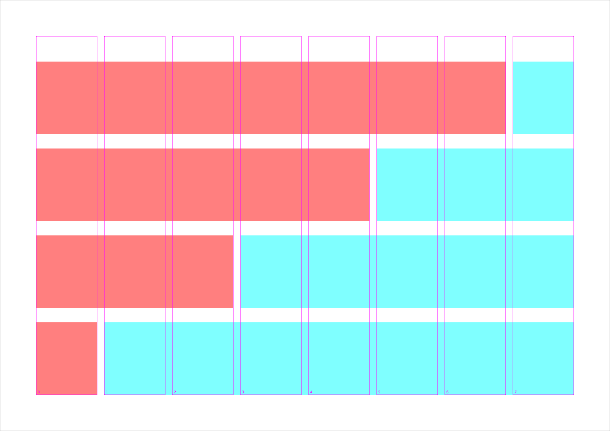


Conviniently, instead of creating a `ColumnGrid` from its `(x, y, w, h)` coordinates, you can initiate it from its margin values relative to the document with `ColumnGrid.from_margint((left_margin, bottom_margin, right_margin, top_margin), subdivisions, gutter)`. Margins are expressed with negative values (following [Vanilla conventions](https://github.com/robotools/vanilla)).

Handy coordinates can be easyly accessed with `ColumnGrid.bottom`, `ColumnGrid.top`, `ColumnGrid.left`, `ColumnGrid.right`, `ColumnGrid.width`, `ColumnGrid.height`.


```python
from drawBotGrid import ColumnGrid

newPage("A4Landscape")

columns = ColumnGrid.from_margins((-20, -100, -20, -50), subdivisions=6, gutter=20)

fill(0, 1, 1, .5) # cyan
rect(columns[0], columns.bottom, columns*3, columns.height)
fill(0, 1, 0, .5) # green
rect(columns[3], columns.top, columns*3, columns.height*-.5)

columns.draw(show_index=True)
```

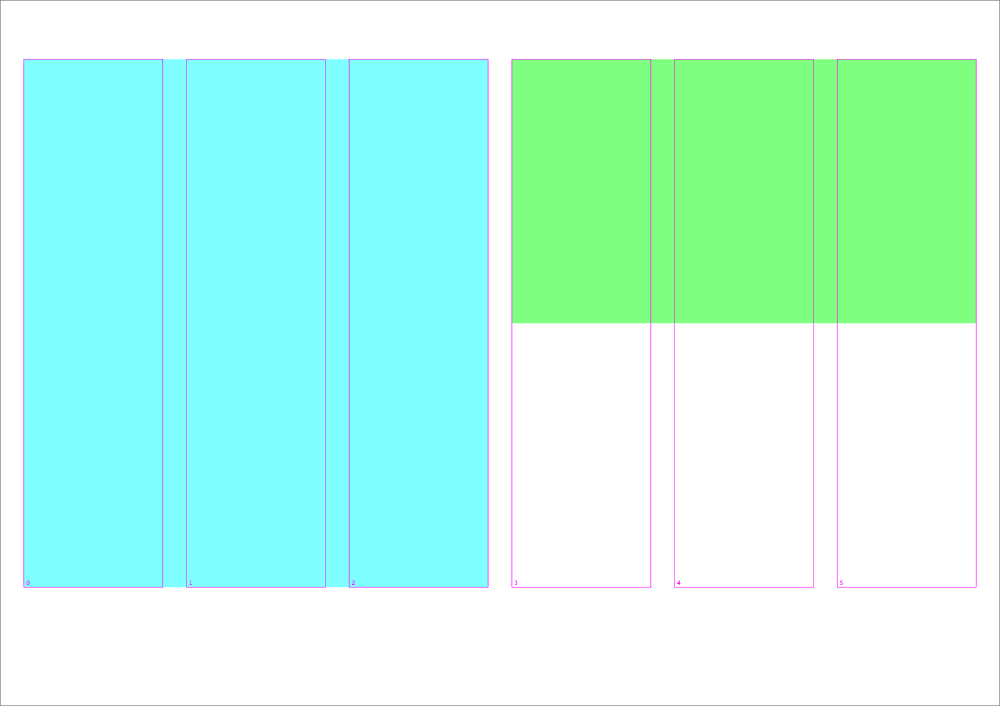


## RowGrid

`RowGrid((x, y, h, w), subdivisions=8, gutter=10)` divides the page in a given number of rows, separated by a gutter, making it easy to retrieve absolute y coordinates within the page. It works like `ColumnGrid` but for horizontal rows.


```python
from drawBotGrid import RowGrid

newPage("A4Landscape")

rows = RowGrid.from_margins((-50, -150, -50, -50), subdivisions=4, gutter=5)

fill(0, 1, 0, .5)  # green
for i in range(4):
    rect(rows.left, rows[i], rows.width*.5, rows*1)

fill(1, 0, 0, .5)  # red
rect(rows.right, rows[2], -rows.width*.5, rows*2)

fill(0, 1, 1, .5)  # cyan
rect(rows.right, rows[0], -rows.width*.25, rows*2)

rows.draw(show_index=True)
```

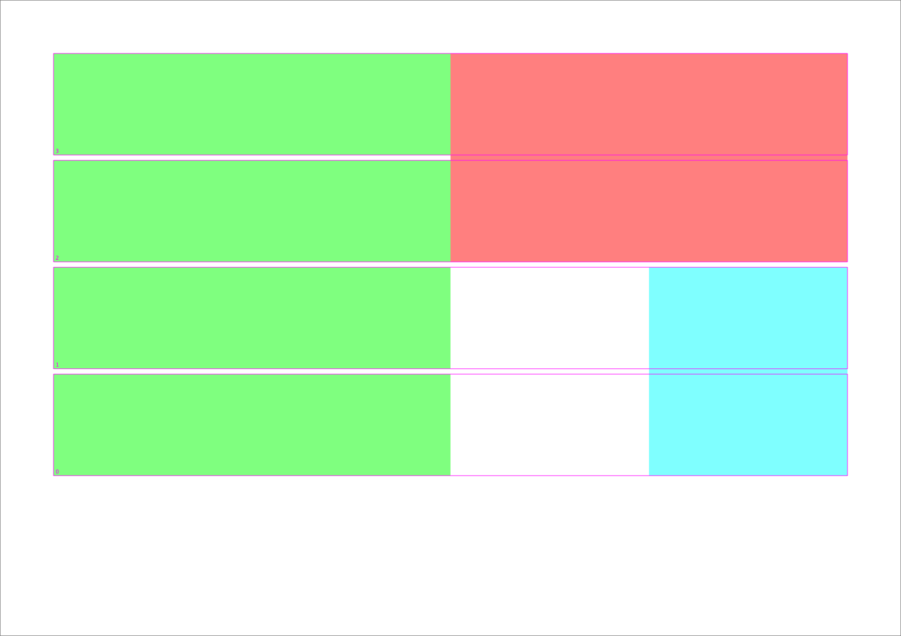


## Grid

`Grid((x, y, h, w),, column_subdivisions=8, row_subdivisions=8, column_gutter=10, row_gutter=10)` combines the powers of `ColumnGrid` and `RowGrid` in a single object, for all your grid needs.

The underlying `ColumnGrid` and `RowGrid` can be accesed through `Grid.columns` and `Grid.rows`, repectiveley. 

```python
from drawBotGrid import Grid

newPage("A4Landscape")

grid = Grid.from_margins((-50, -50, -50, -50), 
                         column_subdivisions=8, 
                         row_subdivisions=8, 
                         column_gutter=5, 
                         row_gutter=5)

fill(0, 1, 0, .5)  # green
for i in range(8):
    rect(grid.columns[0], grid.rows[i], grid.columns*1, grid.rows*1)

fill(0, 1, 1, .5)  # cyan
for i in range(1, 8):
    rect(grid.columns[i], grid.rows[-1], grid.columns*1, grid.rows*-2)

fill(1, 0, 0, .5) # red
rect(grid.columns[1], grid.rows[0], grid.columns*3, grid.rows*6)

fill(1, 0, 1, .5) # pink
rect(grid.columns[4], grid.rows[3], grid.columns*3, grid.rows*3)

grid.draw(show_index=True)
```

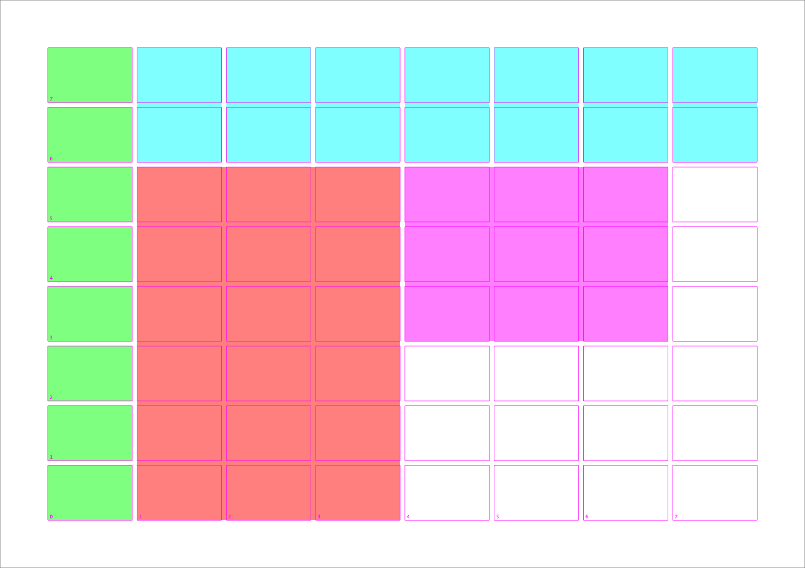


If you're feeling adventurous, `Grid.column` and `Grid.row` can be called directly by a tuple of indexes. `Grid[(1, 5)]` will return the coordinate of the column at index 1 and the row at index 5.

`Grid` can also be multiplied by a tupple. `Grid*(2, 4)` will return the width value of 2 column and the height value of 4 rows (including the required gutters).

```python
from drawBotGrid import Grid

newPage("A4Landscape")

grid = Grid.from_margins((-50, -50, -50, -50), 
                         column_subdivisions=12, 
                         row_subdivisions=4, 
                         column_gutter=5, 
                         row_gutter=5)

fill(0, 1, 0, .5)  # green
rect(*grid[(0, 0)], *grid*(3, 4))

fill(1, 0, 0, .5)  # red
rect(*grid[(3, -2)], *grid*(6, -3))

fill(1, 0, 1, .5) # pink
rect(*grid[(3, -1)], *grid*(3, -1))

fill(0, 1, 1, .5)  # cyan
rect(*grid[(9, -2)], *grid*(3, -2))

grid.draw(show_index=True)
```

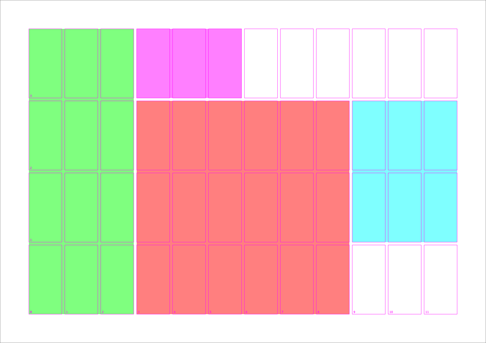

If you made it this far, you likely like grids, so we placed some grids inside your grid.

```python
from drawBotGrid import Grid

newPage("A4Landscape")

main_grid = Grid.from_margins((-50, -50, -50, -50), 
                         column_subdivisions=3, 
                         row_subdivisions=2, 
                         column_gutter=5, 
                         row_gutter=5)

sub_grid = Grid((main_grid.columns[2], main_grid.rows[1], main_grid.columns*1, main_grid.rows*1),
                column_subdivisions=4, 
                row_subdivisions=6, 
                column_gutter=5, 
                row_gutter=5)


other_sub_grid = Grid((main_grid.columns[2], main_grid.rows[0], main_grid.columns*1, main_grid.rows*1),
                       column_subdivisions=2, 
                       row_subdivisions=3, 
                       column_gutter=5, 
                       row_gutter=5)


main_grid.draw(show_index=True)
sub_grid.draw(show_index=True)
other_sub_grid.draw(show_index=True)
```

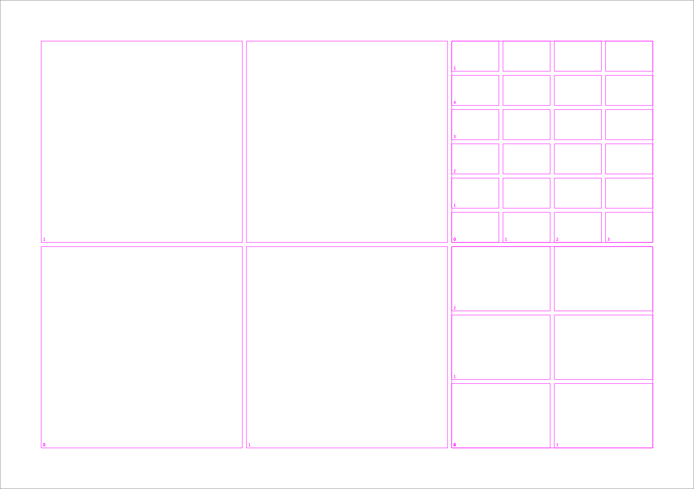


## BaselineGrid

`BaselineGrid((x, y, h, w), possize, line_height)` is a grid helper dedicated to text (it is limited to writing systems organised arround horizontal baselines).

Unlike `RowGrid`, `BaselineGrid` has no gutter and a fixed subdivison width.

Another notable difference is that folowing the top down direction of Latin text paragraphs, the first line,`BaselineGrid[0]` is a the top of the grid, rather than its bottom. 

```python
from drawBotGrid import BaselineGrid

newPage("A4Landscape")

baselines = BaselineGrid.from_margins((-50, -50, -50, -50), 
                         line_height=12)

fill(1, 0, 0, .5) # red
item_width = baselines.width / len(baselines)
for i in range(len(baselines)):
    rect(baselines.left+item_width*i, baselines[i], item_width, baselines*1)

baselines.draw(show_index=True)
```

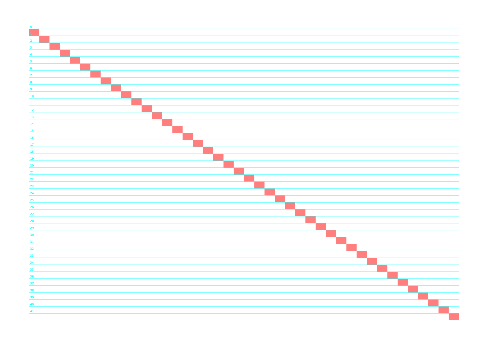


## baselineGridTextBox

`BaselineGrid`only becomes usefull if you can snap text to it. `baselineGridTextBox(text, (x, y, w, h), baselineGrid, align_first_line_only=False, align="left")` is a `textBox` that takes a `BaselineGrid` object as an additonal argument. It will adjust the text `lineHeight` in order ot make it snap to the baseline grid.

```python
from drawBotGrid import ColumnGrid, BaselineGrid, baselineGridTextBox

newPage("A4Landscape")


baselines = BaselineGrid.from_margins((0, 0, 0, 0), 
                         line_height=12)
columns = ColumnGrid((50, baselines[-4], width()-100, baselines*-44), subdivisions=3)

fill(0)
font("Georgia")
fontSize(9)
lineHeight(12)
textBox("This is a classic textBox.\n" + "blah "*1000, 
        (columns[0], columns.bottom, columns*1, columns.height))

baselineGridTextBox("This is a classic baselineGridTextBox.\n" + "blah "*1000, 
                    (columns[1], columns.bottom, columns*1, columns.height),
                    baselines)

baselineGridTextBox("This is a classic baselineGridTextBox\nwith align_first_line_only set to True.\n" + "blah "*1000, 
                    (columns[2], columns.bottom, columns*1, columns.height),
                    baselines,
                    align_first_line_only=True)

baselines.draw(show_index=True)
columns.draw(show_index=True)
```

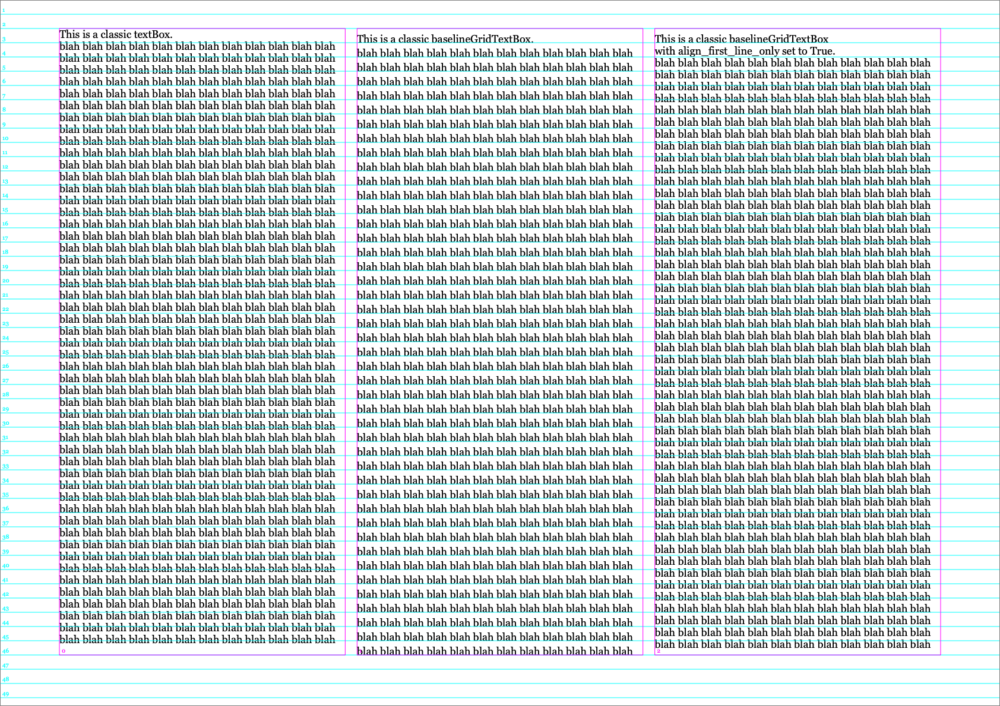

`BaselineGridTextBox` will try to snap your defined `lineHeight` to the next multiple of its `BaselineGrid.line_height`. That mean you can use the same `BaselineGrid` for multiple size of text if you want to.

```python
from drawBotGrid import ColumnGrid, BaselineGrid, baselineGridTextBox

newPage("A4Landscape")


baselines = BaselineGrid.from_margins((0, 0, 0, 0), 
                         line_height=6)
columns = ColumnGrid((50, baselines[-8], width()-100, baselines*-88), subdivisions=3)

fill(0)
font("Georgia")
fontSize(5)
lineHeight(6)
baselineGridTextBox("BaselineGrid: 6pt\nFont Size 5pt\nLine Height: 6pt\n" + "blah "*1000, 
                    (columns[0], columns.bottom, columns*1, columns.height),
                    baselines)

fontSize(10)
lineHeight(10)
baselineGridTextBox("BaselineGrid: 6pt\nFont Size 10pt\nLine Height: 10pt\n" + "blah "*1000, 
                    (columns[1], columns.bottom, columns*1, columns.height),
                    baselines)

fontSize(16)
lineHeight(18)
baselineGridTextBox("BaselineGrid: 6pt\nFont Size 16pt\nLine Height: 18pt\n" + "blah "*1000, 
                    (columns[2], columns.bottom, columns*1, columns.height),
                    baselines)


baselines.draw(show_index=True)
columns.draw(show_index=True)
```

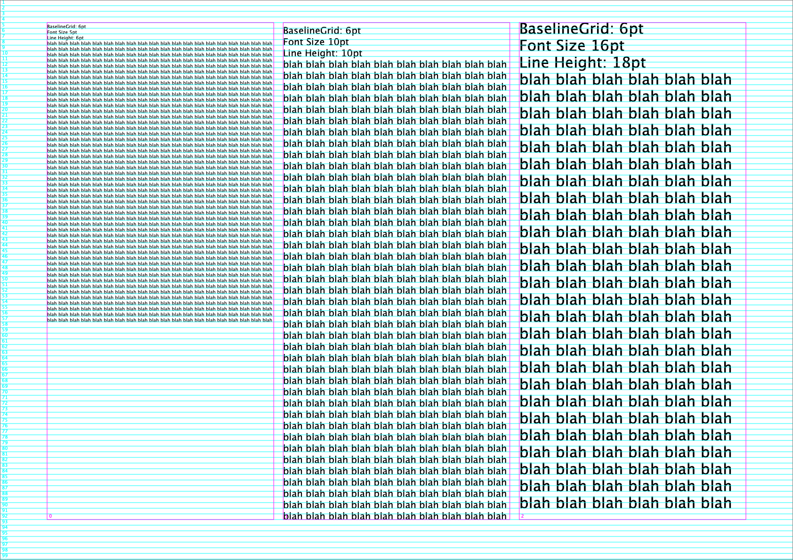


# columnTextBox

`columnTextBox(text, (x, y, w, h), subdivisions=2, gutter=10, align="left")` is a `textBox` powered by an internal `ColumnGrid`. It flows the given text into multiple columns automatically. Like a normal `textBox`, it returns the overflow text is there is any.


Setting the optional argument `draw_grid=True` will draw the underlying grid.

```python
from drawBotGrid import columnTextBox

newPage("A4Landscape")


fill(0)
font("Georgia")
fontSize(11)
lineHeight(15)
hyphenation(True)

text = """Longtemps, je me suis couché de bonne heure. Parfois, à peine ma bougie éteinte, mes yeux se fermaient si vite que je n’avais pas le temps de me dire: «Je m’endors.» Et, une demi-heure après, la pensée qu’il était temps de chercher le sommeil m’éveillait; je voulais poser le volume que je croyais avoir encore dans les mains et souffler ma lumière; je n’avais pas cessé en dormant de faire des réflexions sur ce que je venais de lire, mais ces réflexions avaient pris un tour un peu particulier; il me semblait que j’étais moi-même ce dont parlait l’ouvrage: une église, un quatuor, la rivalité de François Ier et de Charles Quint. Cette croyance survivait pendant quelques secondes à mon réveil; elle ne choquait pas ma raison mais pesait comme des écailles sur mes yeux et les empêchait de se rendre compte que le bougeoir n’était plus allumé. Puis elle commençait à me devenir inintelligible, comme après la métempsycose les pensées d’une existence antérieure; le sujet du livre se détachait de moi, j’étais libre de m’y appliquer ou non; aussitôt je recouvrais la vue et j’étais bien étonné de trouver autour de moi une obscurité, douce et reposante pour mes yeux, mais peut-être plus encore pour mon esprit, à qui elle apparaissait comme une chose sans cause, incompréhensible, comme une chose vraiment obscure. Je me demandais quelle heure il pouvait être; j’entendais le sifflement des trains qui, plus ou moins éloigné, comme le chant d’un oiseau dans une forêt, relevant les distances, me décrivait l’étendue de la campagne déserte où le voyageur se hâte vers la station prochaine; et le petit chemin qu’il suit va être gravé dans son souvenir par l’excitation qu’il doit à des lieux nouveaux, à des actes inaccoutumés, à la causerie récente et aux adieux sous la lampe étrangère qui le suivent encore dans le silence de la nuit, à la douceur prochaine du retour. J’appuyais tendrement mes joues contre les belles joues de l’oreiller qui, pleines et fraîches, sont comme les joues de notre enfance. Je frottais une allumette pour regarder ma montre. Bientôt minuit. C’est l’instant où le malade, qui a été obligé de partir en voyage et a dû coucher dans un hôtel inconnu, réveillé par une crise, se réjouit en apercevant sous la porte une raie de jour. Quel bonheur, c’est déjà le matin! Dans un moment les domestiques seront levés, il pourra sonner, on viendra lui porter secours. L’espérance d’être soulagé lui donne du courage pour souffrir. Justement il a cru entendre des pas; les pas se rapprochent, puis s’éloignent. Et la raie de jour qui était sous sa porte a disparu. C’est minuit; on vient d’éteindre le gaz; le dernier domestique est parti et il faudra rester toute la nuit à souffrir sans remède. Je me rendormais, et parfois je n’avais plus que de courts réveils d’un instant, le temps d’entendre les craquements organiques des boiseries, d’ouvrir les yeux pour fixer le kaléidoscope de l’obscurité, de goûter grâce à une lueur momentanée de conscience le sommeil où étaient plongés les meubles, la chambre, le tout dont je n’étais qu’une petite partie et à l’insensibilité duquel je retournais vite m’unir. Ou bien en dormant j’avais rejoint sans effort un âge à jamais révolu de ma vie primitive, retrouvé telle de mes terreurs enfantines comme celle que mon grand-oncle me tirât par mes boucles et qu’avait dissipée le jour,--date pour moi d’une ère nouvelle,--où on les avait coupées. J’avais oublié cet événement pendant mon sommeil, j’en retrouvais le souvenir aussitôt que j’avais réussi à m’éveiller pour échapper aux mains de mon grand-oncle, mais par mesure de précaution j’entourais complètement ma tête de mon oreiller avant de retourner dans le monde des rêves."""
columnTextBox(text, (50, 50, width()-100, height()-100), subdivisions=3, gutter=15, draw_grid=True)

```

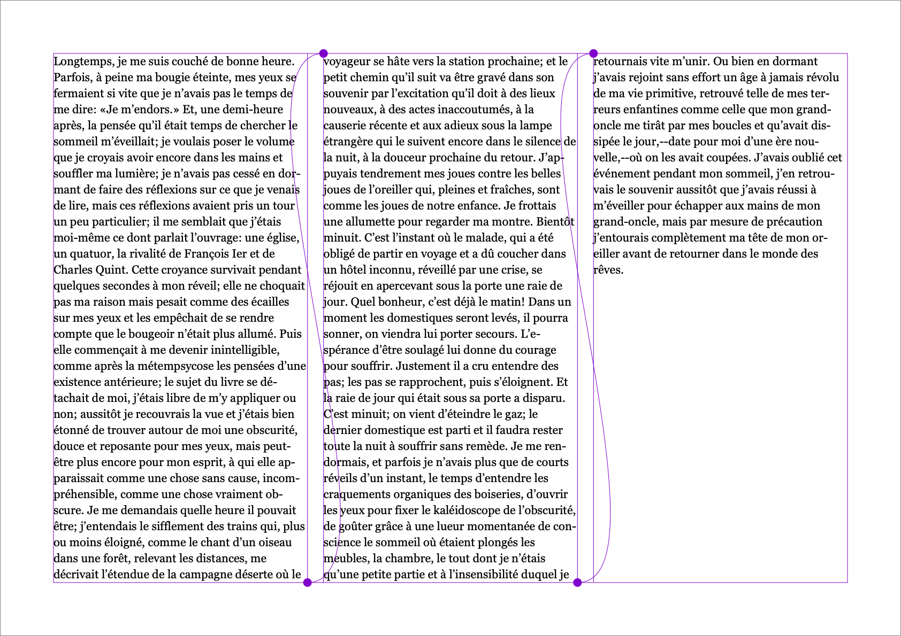


#  columnBaselineGridTextBox

`columnBaselineGridTextBox(text, (x, y, w, h), baselineGrid, subdivisions=2, gutter=10, align="left")` is a `columnTextBox` that takes a `BaselineGrid` object as an additonal argument. It will adjust the text `lineHeight` in order ot make it snap to the baseline grid.


```python
from drawBotGrid import BaselineGrid, columnBaselineGridTextBox

newPage("A4Landscape")


fill(0)
font("Georgia")
fontSize(8)
lineHeight(10)
hyphenation(True)

baselines = BaselineGrid.from_margins((0, -50, 0, -50), 10)
baselines.draw()

text = """Longtemps, je me suis couché de bonne heure. Parfois, à peine ma bougie éteinte, mes yeux se fermaient si vite que je n’avais pas le temps de me dire: «Je m’endors.» Et, une demi-heure après, la pensée qu’il était temps de chercher le sommeil m’éveillait; je voulais poser le volume que je croyais avoir encore dans les mains et souffler ma lumière; je n’avais pas cessé en dormant de faire des réflexions sur ce que je venais de lire, mais ces réflexions avaient pris un tour un peu particulier; il me semblait que j’étais moi-même ce dont parlait l’ouvrage: une église, un quatuor, la rivalité de François Ier et de Charles Quint. Cette croyance survivait pendant quelques secondes à mon réveil; elle ne choquait pas ma raison mais pesait comme des écailles sur mes yeux et les empêchait de se rendre compte que le bougeoir n’était plus allumé. Puis elle commençait à me devenir inintelligible, comme après la métempsycose les pensées d’une existence antérieure; le sujet du livre se détachait de moi, j’étais libre de m’y appliquer ou non; aussitôt je recouvrais la vue et j’étais bien étonné de trouver autour de moi une obscurité, douce et reposante pour mes yeux, mais peut-être plus encore pour mon esprit, à qui elle apparaissait comme une chose sans cause, incompréhensible, comme une chose vraiment obscure. Je me demandais quelle heure il pouvait être; j’entendais le sifflement des trains qui, plus ou moins éloigné, comme le chant d’un oiseau dans une forêt, relevant les distances, me décrivait l’étendue de la campagne déserte où le voyageur se hâte vers la station prochaine; et le petit chemin qu’il suit va être gravé dans son souvenir par l’excitation qu’il doit à des lieux nouveaux, à des actes inaccoutumés, à la causerie récente et aux adieux sous la lampe étrangère qui le suivent encore dans le silence de la nuit, à la douceur prochaine du retour. J’appuyais tendrement mes joues contre les belles joues de l’oreiller qui, pleines et fraîches, sont comme les joues de notre enfance. Je frottais une allumette pour regarder ma montre. Bientôt minuit. C’est l’instant où le malade, qui a été obligé de partir en voyage et a dû coucher dans un hôtel inconnu, réveillé par une crise, se réjouit en apercevant sous la porte une raie de jour. Quel bonheur, c’est déjà le matin! Dans un moment les domestiques seront levés, il pourra sonner, on viendra lui porter secours. L’espérance d’être soulagé lui donne du courage pour souffrir. Justement il a cru entendre des pas; les pas se rapprochent, puis s’éloignent. Et la raie de jour qui était sous sa porte a disparu. C’est minuit; on vient d’éteindre le gaz; le dernier domestique est parti et il faudra rester toute la nuit à souffrir sans remède. Je me rendormais, et parfois je n’avais plus que de courts réveils d’un instant, le temps d’entendre les craquements organiques des boiseries, d’ouvrir les yeux pour fixer le kaléidoscope de l’obscurité, de goûter grâce à une lueur momentanée de conscience le sommeil où étaient plongés les meubles, la chambre, le tout dont je n’étais qu’une petite partie et à l’insensibilité duquel je retournais vite m’unir. Ou bien en dormant j’avais rejoint sans effort un âge à jamais révolu de ma vie primitive, retrouvé telle de mes terreurs enfantines comme celle que mon grand-oncle me tirât par mes boucles et qu’avait dissipée le jour,--date pour moi d’une ère nouvelle,--où on les avait coupées. J’avais oublié cet événement pendant mon sommeil, j’en retrouvais le souvenir aussitôt que j’avais réussi à m’éveiller pour échapper aux mains de mon grand-oncle, mais par mesure de précaution j’entourais complètement ma tête de mon oreiller avant de retourner dans le monde des rêves."""*2
columnBaselineGridTextBox(text, (50, 50, width()-100, height()-100), baselines, subdivisions=4, gutter=40, draw_grid=True)

```

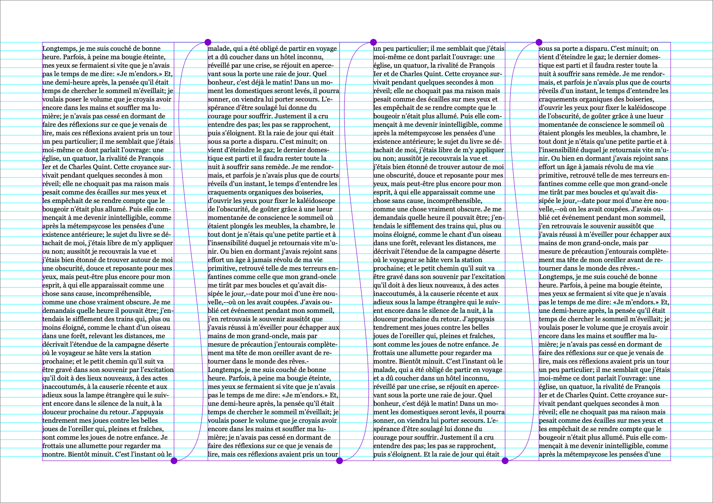


# verticalAlignTextBox
`verticalAlignTextBox(text, (x, y, w, h), vertical_align="top", align="left")` is a `textBox` that takes `vertical_align` as an additonal argument. Possible values are `"top"`, `"center"` and `"bottom"`.

```python
from drawBotGrid import ColumnGrid, verticalAlignTextBox

newPage("A4Landscape")


columns = ColumnGrid.from_margins((-50, -150, -50, -150), subdivisions=3, gutter=10)

font("Georgia")
fontSize(34)
lineHeight(40)

verticalAlignTextBox("HELLO\nFROM UP\nTHERE", 
                     (columns[0], columns.bottom, columns*1, columns.height),
                     vertical_align="top",
                     align="center")

verticalAlignTextBox("HELLO\nFROM MID\nTHERE", 
                     (columns[1], columns.bottom, columns*1, columns.height),
                     vertical_align="center",
                     align="center")

verticalAlignTextBox("HELLO\nFROM DOWN\nTHERE", 
                     (columns[2], columns.bottom, columns*1, columns.height),
                     vertical_align="bottom",
                     align="center")

columns.draw(show_index=True)

```

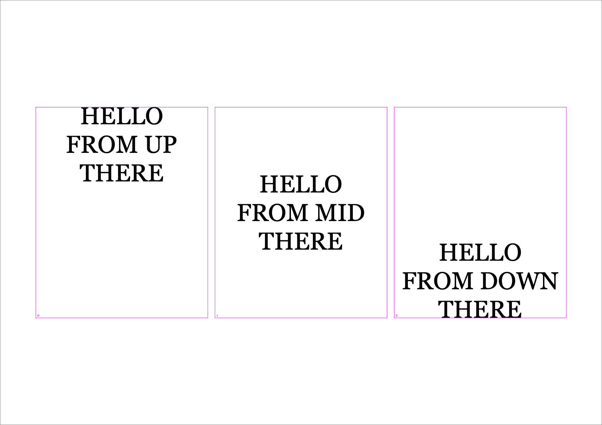


# imageBox

`imageBox(image_path, (x, y, w, h), fitting="fit", anchor=("left", "top"), draw_box_frame=False)` behaves like `textBox` but for images.
By default, it takes an image or imageObject and scale it so that it fits within a given box. The `fitting` argument can be `fit`, `fill` or `crop`.

- `fitting="fit"` will scale the image so that it fits within the box.
- `fitting="fill"` will scale the image so that it fill the entire box and that at least the image width or height is displayed entirely.
- `fitting="crop"` will show the image at full size, and crop it so that it tays within the box.

```python
from drawBotGrid import ColumnGrid, imageBox

newPage("A4Landscape")

font("Georgia")
fontSize(14)
columns = ColumnGrid.from_margins((-50, -80, -50, -80), subdivisions=3)

img_path = "/Users/mathieu/Dropbox/20 current dev/Custom Modules/DrawBotGrid/drawBotGrid/docs/drawMech-small.jpg"
imageBox(img_path, (columns[0], columns.bottom, columns*1, columns.height), fitting="crop", anchor=("center", "top"))
textBox('fitting="crop"', (columns[0], columns.bottom-40, columns*1, 30), align="center")

imageBox(img_path, (columns[1], columns.bottom, columns*1, columns.height), fitting="fill", anchor=("center", "top"))
textBox('fitting="fill"', (columns[1], columns.bottom-40, columns*1, 30), align="center")

imageBox(img_path, (columns[2], columns.bottom, columns*1, columns.height), fitting="fit", anchor=("center", "top"))
textBox('fitting="fit"', (columns[2], columns.bottom-40, columns*1, 30), align="center")

columns.draw(show_index=True)
```

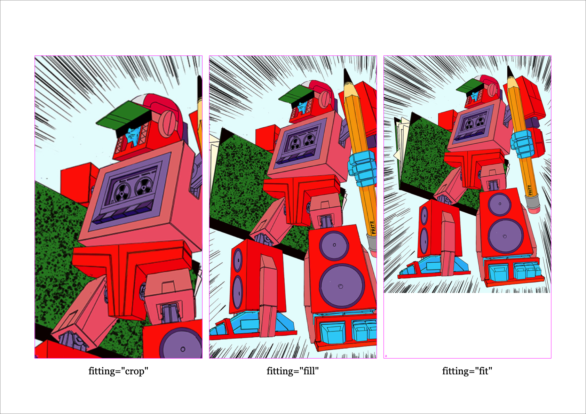

### fitting=fit

```python
from drawBotGrid import Grid, imageBox

newPage("A4Landscape")

grid = Grid.from_margins((-50, -50, -50, -50), column_subdivisions=10, row_subdivisions=6)
grid.draw()

img_path = "https://raw.githubusercontent.com/mathieureguer/drawbotgrid/main/drawBotGrid/docs/drawMech-small.jpg"
imageBox(img_path, (grid.columns[0], grid.rows[0], grid.columns*4, grid.rows*4), draw_box_frame=True)
imageBox(img_path, (grid.columns[0], grid.rows[4], grid.columns*4, grid.rows*2), draw_box_frame=True)
imageBox(img_path, (grid.columns[4], grid.rows[0], grid.columns*3, grid.rows*4), draw_box_frame=True)
imageBox(img_path, (grid.columns[7], grid.rows[0], grid.columns*3, grid.rows*3), draw_box_frame=True)
imageBox(img_path, (grid.columns[7], grid.rows[3], grid.columns*3, grid.rows*2), draw_box_frame=True)
imageBox(img_path, (grid.columns[4], grid.rows[4], grid.columns*2, grid.rows*2), draw_box_frame=True)
imageBox(img_path, (grid.columns[6], grid.rows[4], grid.columns*1, grid.rows*2), draw_box_frame=True)
imageBox(img_path, (grid.columns[7], grid.rows[5], grid.columns*3, grid.rows*1), draw_box_frame=True)


```

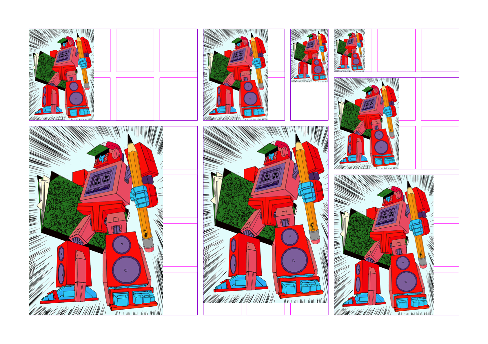

### fitting=fill

```python
from drawBotGrid import Grid, imageBox

newPage("A4Landscape")

grid = Grid.from_margins((-50, -50, -50, -50), column_subdivisions=10, row_subdivisions=6)
grid.draw()

img_path = "https://raw.githubusercontent.com/mathieureguer/drawbotgrid/main/drawBotGrid/docs/drawMech-small.jpg"
imageBox(img_path, (grid.columns[0], grid.rows[0], grid.columns*4, grid.rows*4), draw_box_frame=True, fitting="fill", anchor=("center", "top"))
imageBox(img_path, (grid.columns[0], grid.rows[4], grid.columns*4, grid.rows*2), draw_box_frame=True, fitting="fill", anchor=("center", "top"))
imageBox(img_path, (grid.columns[4], grid.rows[0], grid.columns*3, grid.rows*4), draw_box_frame=True, fitting="fill", anchor=("center", "top"))
imageBox(img_path, (grid.columns[7], grid.rows[0], grid.columns*3, grid.rows*3), draw_box_frame=True, fitting="fill", anchor=("center", "top"))
imageBox(img_path, (grid.columns[7], grid.rows[3], grid.columns*3, grid.rows*2), draw_box_frame=True, fitting="fill", anchor=("center", "top"))
imageBox(img_path, (grid.columns[4], grid.rows[4], grid.columns*2, grid.rows*2), draw_box_frame=True, fitting="fill", anchor=("center", "top"))
imageBox(img_path, (grid.columns[6], grid.rows[4], grid.columns*1, grid.rows*2), draw_box_frame=True, fitting="fill", anchor=("center", "top"))
imageBox(img_path, (grid.columns[7], grid.rows[5], grid.columns*3, grid.rows*1), draw_box_frame=True, fitting="fill", anchor=("center", "top"))


```

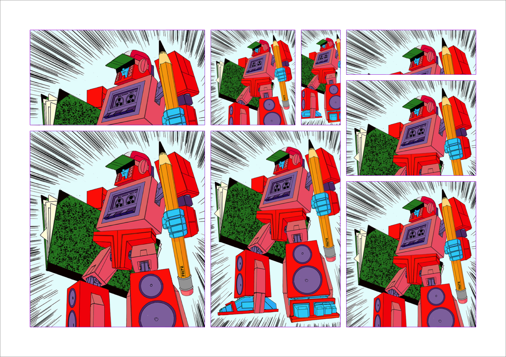

### fitting=crop

```python
from drawBotGrid import Grid, imageBox

newPage("A4Landscape")

grid = Grid.from_margins((-50, -50, -50, -50), column_subdivisions=10, row_subdivisions=6)
grid.draw()

img_path = "/Users/mathieu/Dropbox/20 current dev/Custom Modules/DrawBotGrid/drawBotGrid/docs/drawMech-small.jpg"
imageBox(img_path, (grid.columns[0], grid.rows[0], grid.columns*4, grid.rows*4), draw_box_frame=True, fitting="crop", anchor=("center", "top"))
imageBox(img_path, (grid.columns[0], grid.rows[4], grid.columns*4, grid.rows*2), draw_box_frame=True, fitting="crop", anchor=("center", "top"))
imageBox(img_path, (grid.columns[4], grid.rows[0], grid.columns*3, grid.rows*4), draw_box_frame=True, fitting="crop", anchor=("center", "top"))
imageBox(img_path, (grid.columns[7], grid.rows[0], grid.columns*3, grid.rows*3), draw_box_frame=True, fitting="crop", anchor=("center", "top"))
imageBox(img_path, (grid.columns[7], grid.rows[3], grid.columns*3, grid.rows*2), draw_box_frame=True, fitting="crop", anchor=("center", "top"))
imageBox(img_path, (grid.columns[4], grid.rows[4], grid.columns*2, grid.rows*2), draw_box_frame=True, fitting="crop", anchor=("center", "top"))
imageBox(img_path, (grid.columns[6], grid.rows[4], grid.columns*1, grid.rows*2), draw_box_frame=True, fitting="crop", anchor=("center", "top"))
imageBox(img_path, (grid.columns[7], grid.rows[5], grid.columns*3, grid.rows*1), draw_box_frame=True, fitting="crop", anchor=("center", "top"))


```

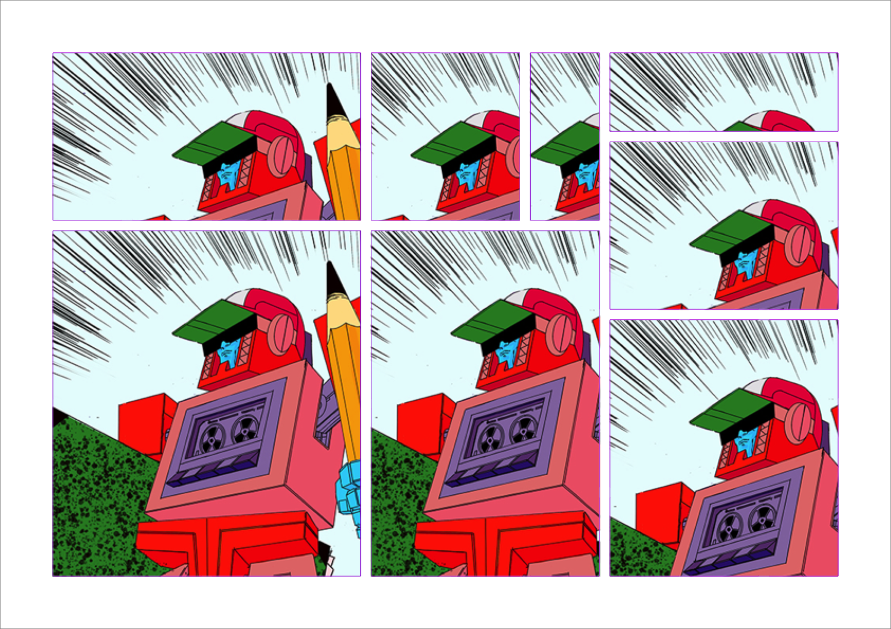

### anchors

By default, when cropped or smaller than the box, the image is anchored to the top left of a the imageBox. An `anchor=("left", "top")` argument can be provided to adjust the origin of the image within the box. `anchor` must be a tupple describing the horizontal and vertical positioning. Possible values for horizontal positioning are `"left"`, `"center"` or `"right"`, possible values for vertical positioning are `"top"`, `"center"` or `"bottom"`.

```python
from drawBotGrid import Grid, ColumnGrid, imageBox

newPage("A4Landscape")

global_grid = ColumnGrid.from_margins((-60, -40, -60, -40), subdivisions=2, gutter=40)
grid_left = Grid((global_grid[0], global_grid.bottom, global_grid*1, global_grid.height), column_subdivisions=3, row_subdivisions=3)
grid_right= Grid((global_grid[1], global_grid.bottom, global_grid*1, global_grid.height), column_subdivisions=3, row_subdivisions=3)

img_path = "https://raw.githubusercontent.com/mathieureguer/drawbotgrid/main/drawBotGrid/docs/drawMech-small.jpg"

imageBox(img_path, (grid_left.columns[0], grid_left.rows[0], grid_left.columns*1, grid_left.rows*1), fitting="crop", scale=.15, anchor=("left", "bottom"), draw_box_frame=True)
imageBox(img_path, (grid_left.columns[0], grid_left.rows[1], grid_left.columns*1, grid_left.rows*1), fitting="crop", scale=.15, anchor=("left", "center"), draw_box_frame=True)
imageBox(img_path, (grid_left.columns[0], grid_left.rows[2], grid_left.columns*1, grid_left.rows*1), fitting="crop", scale=.15, anchor=("left", "top"), draw_box_frame=True)

imageBox(img_path, (grid_left.columns[1], grid_left.rows[0], grid_left.columns*1, grid_left.rows*1), fitting="crop", scale=.15, anchor=("center", "bottom"), draw_box_frame=True)
imageBox(img_path, (grid_left.columns[1], grid_left.rows[1], grid_left.columns*1, grid_left.rows*1), fitting="crop", scale=.15, anchor=("center", "center"), draw_box_frame=True)
imageBox(img_path, (grid_left.columns[1], grid_left.rows[2], grid_left.columns*1, grid_left.rows*1), fitting="crop", scale=.15, anchor=("center", "top"), draw_box_frame=True)

imageBox(img_path, (grid_left.columns[2], grid_left.rows[0], grid_left.columns*1, grid_left.rows*1), fitting="crop", scale=.15, anchor=("right", "bottom"), draw_box_frame=True)
imageBox(img_path, (grid_left.columns[2], grid_left.rows[1], grid_left.columns*1, grid_left.rows*1), fitting="crop", scale=.15, anchor=("right", "center"), draw_box_frame=True)
imageBox(img_path, (grid_left.columns[2], grid_left.rows[2], grid_left.columns*1, grid_left.rows*1), fitting="crop", scale=.15, anchor=("right", "top"), draw_box_frame=True)

imageBox(img_path, (grid_right.columns[0], grid_right.rows[0], grid_right.columns*1, grid_right.rows*1), fitting="crop", scale=1, anchor=("left", "bottom"), draw_box_frame=True)
imageBox(img_path, (grid_right.columns[0], grid_right.rows[1], grid_right.columns*1, grid_right.rows*1), fitting="crop", scale=1, anchor=("left", "center"), draw_box_frame=True)
imageBox(img_path, (grid_right.columns[0], grid_right.rows[2], grid_right.columns*1, grid_right.rows*1), fitting="crop", scale=1, anchor=("left", "top"), draw_box_frame=True)

imageBox(img_path, (grid_right.columns[1], grid_right.rows[0], grid_right.columns*1, grid_right.rows*1), fitting="crop", scale=1, anchor=("center", "bottom"), draw_box_frame=True)
imageBox(img_path, (grid_right.columns[1], grid_right.rows[1], grid_right.columns*1, grid_right.rows*1), fitting="crop", scale=1, anchor=("center", "center"), draw_box_frame=True)
imageBox(img_path, (grid_right.columns[1], grid_right.rows[2], grid_right.columns*1, grid_right.rows*1), fitting="crop", scale=1, anchor=("center", "top"), draw_box_frame=True)

imageBox(img_path, (grid_right.columns[2], grid_right.rows[0], grid_right.columns*1, grid_right.rows*1), fitting="crop", scale=1, anchor=("right", "bottom"), draw_box_frame=True)
imageBox(img_path, (grid_right.columns[2], grid_right.rows[1], grid_right.columns*1, grid_right.rows*1), fitting="crop", scale=1, anchor=("right", "center"), draw_box_frame=True)
imageBox(img_path, (grid_right.columns[2], grid_right.rows[2], grid_right.columns*1, grid_right.rows*1), fitting="crop", scale=1, anchor=("right", "top"), draw_box_frame=True)
```

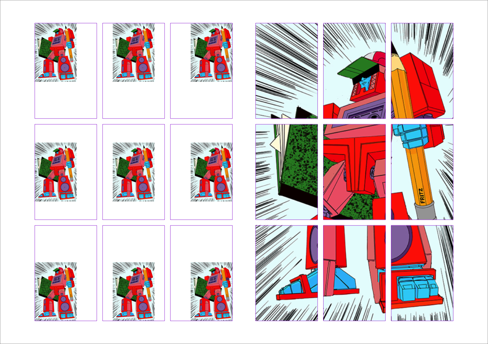

Additionally, when using `fitting="crop"`, a `scale` argument can be provided to control the size at which the image will be displayed inside the `ìmageBox`.

When using `fitting="fill"` or `fitting="fit"`, the scale argument will be ignored, as the scale is automatically calculated against the box size.

```python
from drawBotGrid import Grid, imageBox

newPage("A4Landscape")

grid = Grid.from_margins((-60, -40, -60, -40), column_subdivisions=3, row_subdivisions=3)


img_path = "https://raw.githubusercontent.com/mathieureguer/drawbotgrid/main/drawBotGrid/docs/drawMech-small.jpg"

imageBox(img_path, (grid.columns[0], grid.rows[2], grid.columns*1, grid.rows*1), fitting="crop", scale= .5, anchor=("right", "top"), draw_box_frame=True)
imageBox(img_path, (grid.columns[1], grid.rows[2], grid.columns*1, grid.rows*1), fitting="crop", scale= .6, anchor=("right", "top"), draw_box_frame=True)
imageBox(img_path, (grid.columns[2], grid.rows[2], grid.columns*1, grid.rows*1), fitting="crop", scale= .7, anchor=("right", "top"), draw_box_frame=True)
imageBox(img_path, (grid.columns[0], grid.rows[1], grid.columns*1, grid.rows*1), fitting="crop", scale= .8, anchor=("right", "top"), draw_box_frame=True)
imageBox(img_path, (grid.columns[1], grid.rows[1], grid.columns*1, grid.rows*1), fitting="crop", scale= .9, anchor=("right", "top"), draw_box_frame=True)
imageBox(img_path, (grid.columns[2], grid.rows[1], grid.columns*1, grid.rows*1), fitting="crop", scale=1  , anchor=("right", "top"), draw_box_frame=True)
imageBox(img_path, (grid.columns[0], grid.rows[0], grid.columns*1, grid.rows*1), fitting="crop", scale=1.2, anchor=("right", "top"), draw_box_frame=True)
imageBox(img_path, (grid.columns[1], grid.rows[0], grid.columns*1, grid.rows*1), fitting="crop", scale=1.4, anchor=("right", "top"), draw_box_frame=True)
imageBox(img_path, (grid.columns[2], grid.rows[0], grid.columns*1, grid.rows*1), fitting="crop", scale=1.6, anchor=("right", "top"), draw_box_frame=True)

```

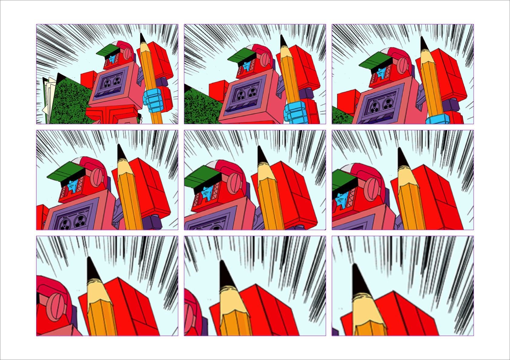


